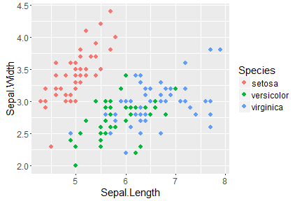
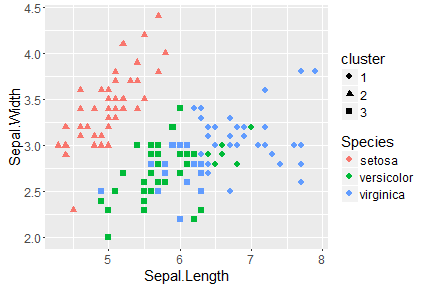
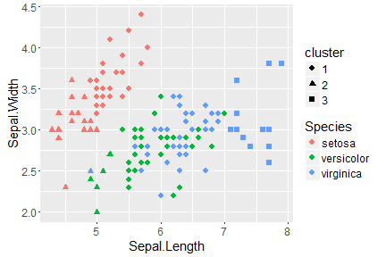

## Introduction
This app use iris dataset in R to test two clustering algorithm: K-means and Hierarchical Clustering.
The method of use this app is as follow:

1. Define the number of clusters
2. Choose a clustering algorithm(either K-means or Hierarchical Clustering)
3. Press the "Run!" button
4. A plot will show result of the algorithm in the mainPanel

--- .class #id 

## Initial screen
A plot of the raw data is show in the mainPanel

```r
library(ggplot2)
library(fpc)
data(iris)
ggplot(data = iris, aes(x = Sepal.Length, y = Sepal.Width)) + 
        geom_point(aes(colour = Species),size=2.5)+
        theme(text = element_text(size = 15))
```



--- .class #id 

## clustering algorithm 1: Kmeans
Take the cluster number equals to 3 for example, the the results of the algorithm are as follows:

```r
k <- 3
km <- kmeans(iris[,1:2],k)
cluster <- factor(km$cluster)
ggplot(data = iris, aes(x = Sepal.Length, y = Sepal.Width)) + 
        geom_point(aes(colour = Species,shape=cluster),size=2.5)+
        theme(text = element_text(size = 15))
```



--- .class #id 

## clustering algorithm 2: Hierarchical Clustering
Take the cluster number equals to 3 for example, the the results of the algorithm are as follows:

```r
k <- 3
hc <- hclust(dist(iris[,1:2]))
hc_cut <- cutree(hc, k)
cluster <- factor(hc_cut)
ggplot(data = iris, aes(x = Sepal.Length, y = Sepal.Width)) + 
        geom_point(aes(colour = Species,shape=cluster),size=2.5)+
        theme(text = element_text(size = 15))
```


